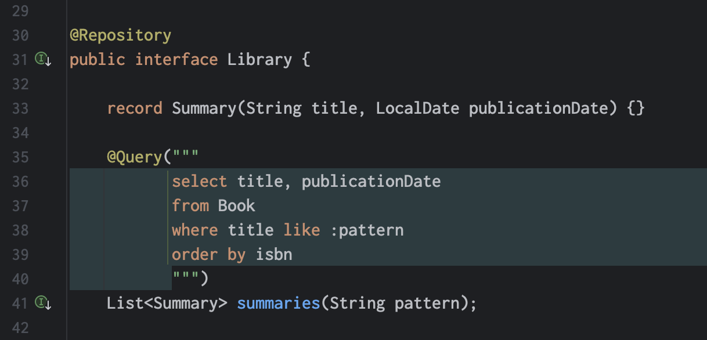

= Doing away with SELECT NEW
Gavin King
:awestruct-tags: ["Jakarta Persistence", "Jakarta Data", "Hibernate ORM"]
:awestruct-layout: blog-post
---

The JPQL `select new` syntax originated in the earliest days of Hibernate, providing a way to package a query projection list into a Java object.
This was before Java had generics or record types, so you would use it like this:

[source, java]
List list =
        session.createQuery("select new Summary(b.title, b.publicationDate) from Book b")
                .list();
Iterator iter = list.iterator();
while (iter.hasNext()) {
    Summary summary = (Summary) iter.next();
    ...
}

This thing found its way into JPA 1.0 with essentially no change.

JPA 2.0 introduced support for Java generics, which lead to this variation:

[source, java]
List
 list =
        session.createQuery("select new Summary(b.title, b.publicationDate) from Book b", Summary.class)
                .getResultList();
for (Summary summary : list) {
    ...
}

And then nothing else changed for more than a decade.

In Hibernate 6, I decided to streamline this.
In recent releases of Hibernate ORM it's been possible to write:

[source, java]
var list =
        session.createQuery("select title, publicationDate from Book", Summary.class)
                .getResultList();
for (var summary in list) {
    ...
}

Since we're explicitly passing the return type to `createQuery()`,  Hibernate can infer the `select new` bit.
This even works in https://hibernate.org/repositories[Hibernate Data Repositories], where we can write a repository method like this:

[source,java]
@Query("select title, publicationDate from Book")
List
 summaries();

The Java language has got better too, and so nowadays you would write the `Summary` class as a `record`:

[source,java]
record Summary(String title, LocalDate publicationDate) {}

I'm blogging about all this partly because it's come to my attention that plenty of you still don't know about this.
It's a small thing--one of many, many small things that make Hibernate 6 so much nicer to use.

The other reason this is something worth blogging about is that I want to https://github.com/jakartaee/persistence/issues/420[make it standard in Jakarta Persistence 4].
In fact, we've already wrapped up work on including this feature in Jakarta Data, and it's https://github.com/jakartaee/data/issues/539[coming in Data 1.1].
