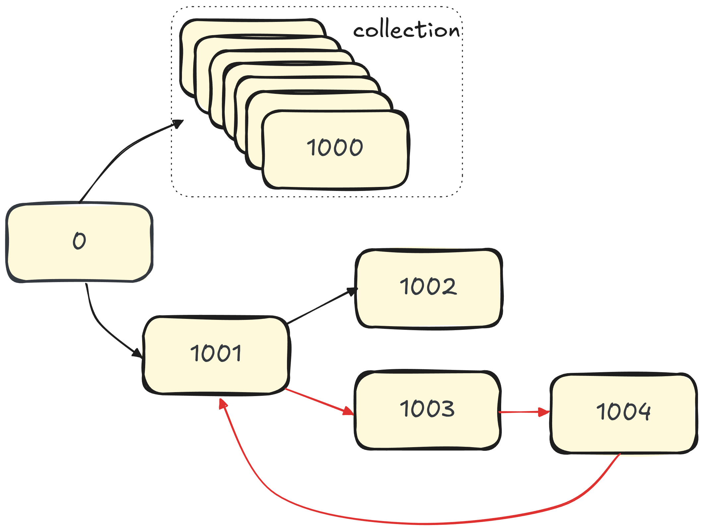
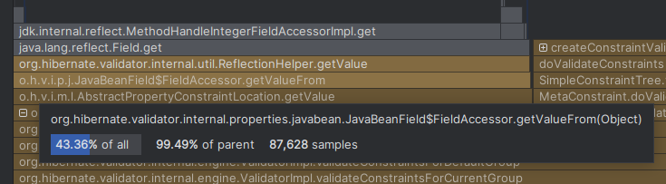

= "Faster Than Ever: A Look at Hibernate Validator 9.1's Performance"
Marko Bekhta
:awestruct-tags: [ "Hibernate Validator", "Bean Validation", "Discussions" ]
:awestruct-layout: blog-post
---

We recently announced the release of Hibernate Validator 9.1.0.Alpha2,
where we hinted that this new series focuses on performance improvements.

+++<!-- more -->+++

Let's dive into what has changed and see some numbers, after all, we all want to see those <<benchmark-results,bar charts>>!

== What changed?

Our initial goal was to improve the Hibernate Validator's cascading validation of object graphs with a lot of nodes.
The known underlying problem causing the performance degradation was the tracking of already processed beans.

Since the validator has to determine the type of the validated node instance at runtime,
it needs to keep track of the beans it has already encountered to detect any loops in the object graph and correctly stop
traversing it. This tracking also has to handle group conversion, i.e. it is okay to go through the same object instance multiple times
as long as it is for a validation group that hasn't yet been processed for that instance.

[[figure-bean-graph]]
.Bean graph
====

- Rectangles represent the bean nodes.
- Arrows show how the beans are connected.
- Red arrows show the path that is causing a validation loop.
====
The original approach to tracking processed beans relied on a couple of collections that were gradually populated as
we traversed the object graph. It was pretty efficient for as long as the object graph didn't contain a lot of nodes.
Taking the <<figure-bean-graph,example from above>>, depending on the ordering, we may end up performing the validation of the node `0`,
then going into the collection and going through all the nodes there, then proceeding to the node `1001`, from which we'd
go to `1002` and then to `1003`, `1004` and create a validation loop back to `1001`.
Once we are done with the node, we would add it to a tracking collection.
Then, before stepping into any of the following nodes, we first have to check whether we've already processed it
for the current validation group we are about to process this bean for.
And that would mean checking against a constantly growing collection.

We tackled this from multiple directions. First of all, if we can determine that the particular node cannot be part of the
validation path loop we can skip tracking that node entirely. The idea that we applied here is that a bean cannot cause a loop
if it does not have any cascadable nodes, or the ones that it contains themselves cannot cause a loop.
Second, if we could discard the beans that are no longer relevant for tracking,
we would be able to keep only a reasonable number of beans to check, making the check more efficient.
Instead of maintaining a collection of processed paths, we switched to a stack-like approach, where we only keep
the nodes from the current path under validation.

With these ideas in mind, going back to the <<figure-bean-graph,above example>>, we would ignore the tracking checks for the nodes in the collection (`1..1000`),
and the `1002` node as those do not have any further cascading validation. And when it comes to the validation loop
`1001 -> 1003 -> 1004 -> 1001`, we would only need to check these three nodes.

Changing the approach to bean tracking consequently opened up the possibility of reworking the validation path implementation,
which was on our radar for a while now.
While we required paths for bean tracking, the internal path had an immutable representation, which required a lot of
allocations and copy operations. With stack-based tracking, the internal path representation no longer had to be immutable;
hence, we took advantage of that.

As it usually happens with performance work, while testing, we have also identified and addressed a few low-hanging fruits:

* We made some changes in the validation message interpolation area. While message interpolation in itself is far from a simple problem,
we've identified a possibility to reduce the number of unnecessary string operations and collection copying and acted on it.
* Another interesting observation was a switch to immutable collections (i.e. those backing the `List.of`/`Set.of`/`Map.of`).
Hibernate Validator often has to iterate over collections with various validation metadata, and while this switch from `Collections.unmodifiable*(..)`
didn't cause a huge difference, we've observed that in some cases the iteration improved, be it just because of getting
rid of the delegating iterator that the `Collections.unmodifiable*(..)` creates.
* On a related note, we've also introduced a way to share data during constraint initialization, which allowed us to
reuse the `Pattern` instances for `@Pattern` constraint where the regular expressions and flags match. This would lead
to fewer objects created if an application relies on the same validation patterns for different properties.
* We also removed some unnecessary collection instantiation/copying and made a few other more minor adjustments that, combined, provided a noticeable improvement.

You can find most of the relevant changes in the following diff sets:

* link:https://github.com/hibernate/hibernate-validator/compare/93dbfd789bf202789ffe89fdc5aba5217da51743...5727b3d234dfcb831695357666afa600ff2d3a3a[Introduction of new processed beans tracking approach and message interpolation improvements].
* link:https://github.com/hibernate/hibernate-validator/compare/93dbfd789bf202789ffe89fdc5aba5217da51743...bb2973c6f41b2406ae77259f0a08be254f47ba67[Change of the validation path implementation].
* link:https://github.com/hibernate/hibernate-validator/compare/fac185adec0aa047bec40ec5970495bdaa5bb325...e7bb1d1604f233595f53ad9d84fc9a975b34d8f1[Leveraging internal validation path mutability even further].

== Benchmarked versions

We decided to focus our benchmark on the following three Hibernate Validator versions:

* Hibernate Validator 9.1.0.Alpha2 (released on September 19th 2025)
* Hibernate Validator 9.0.1.Final (released on Jun 13th 2025)
* Hibernate Validator 6.0.23.Final (released on February 9th 2022)

Why such a selection? We definitely want to compare the latest stable 9.0 series to the new, currently in development, 9.1, to see
the effect of the improvements. As for the 6.0 -- it is the version for which we've published
the link:https://in.relation.to/2017/10/31/bean-validation-benchmark-revisited/[previous benchmark results],
hence it would be interesting to see how far we've gone since then.

== Performed benchmarks

=== Hibernate Validator JMH benchmarks

At Hibernate Validator, we maintain a set of link:https://github.com/hibernate/hibernate-validator/tree/main/performance[JMH benchmarks],
each targeting a specific area or problem. These benchmarks can be executed against different versions
of Hibernate Validator, allowing us to test and compare performance results easily.

As changes introduced in 9.1 are targeting processed bean tracking, validation path implementation and message interpolation,
we have decided to present the results for the following benchmarks:

* link:https://github.com/hibernate/hibernate-validator/blob/main/performance/src/main/jakarta/org/hibernate/validator/performance/simple/SimpleSingleElementValidation.java[`SimpleSingleElementValidation`]
is a straightforward benchmark that uses a simple bean with a couple of constraints and executes three scenarios:
  - When validation is successful (to measure the performance of the "happy path")
  - When validation results in constraint violations.
  - When validation results in constraint violations, but no message interpolation is involved.
* link:https://github.com/hibernate/hibernate-validator/blob/main/performance/src/main/jakarta/org/hibernate/validator/performance/cascaded/CascadedWithLotsOfItemsValidation.java[`CascadedWithLotsOfItemsValidation`]
is a benchmark that validates a bean with a container, cascading to its elements.
This is the scenario where processed bean tracking is required.
* link:https://github.com/hibernate/hibernate-validator/blob/main/performance/src/main/jakarta/org/hibernate/validator/performance/cascaded/CascadedWithLotsOfItemsAndCyclesValidation.java[`CascadedWithLotsOfItemsAndCyclesValidation`]
is a benchmark similar to the previous one, with additional introduction of cycles into the validated model,
i.e. cascading validation needs to correctly terminate when the already processed bean is encountered.

=== Bean Validation benchmark

While the link:https://github.com/hibernate/beanvalidation-benchmark[Bean Validation benchmark] is based on the Bean Validation 1.1 features,
it presents much more complex testing scenarios that can be considered closer to real application usage.
This suite consists of two benchmarks:

* link:https://github.com/hibernate/beanvalidation-benchmark/blob/master/jmh-benchmarks/src/main/java/org/apache/bval/bench/benchmarks/ParsingBeansSpeedBenchmark.java[`ParsingBeansSpeedBenchmark`]
evaluates the metadata building phase.
* link:https://github.com/hibernate/beanvalidation-benchmark/blob/master/jmh-benchmarks/src/main/java/org/apache/bval/bench/benchmarks/RawValidationSpeedBenchmark.java[`RawValidationSpeedBenchmark`]
evaluates the validation.

== Methodology

=== Choose your bench system wisely

The workstation or box on which you want to run the benchmarks must meet certain general requirements.
In particular, stay away from burstable CPU configurations or laptops that may start throttling quickly under the load.
These benchmarks are CPU-intensive, hence it is best to run them on a system with good cooling.

To produce the results in this post, we used a Fedora 42 (`6.16.7-200.fc42.x86_64`) Intel(R) Core(TM) i9 workstation with 128 GB of RAM.
Benchmarks were started on an otherwise idle system, i.e. with no other significant processes running except the OS and a terminal.

Tests were executed with the following JDK:

[source, bash, indent=0]
----
openjdk version "21.0.8" 2025-07-15 LTS
OpenJDK Runtime Environment Temurin-21.0.8+9 (build 21.0.8+9-LTS)
OpenJDK 64-Bit Server VM Temurin-21.0.8+9 (build 21.0.8+9-LTS, mixed mode, sharing)
----

=== Run, run and then run again and then again

These benchmarks were performed numerous times during development and then when preparing this post.
While all of these benchmarks come with already configured numbers of warmup and measurement iterations,
it is a good idea to try to increase the number of warmup iterations and let the benchmark run for some time.
Doing so will allow you to observe and compare the results from iteration to iteration and will help you identify
at which point the benchmarks become stable on your test system.

The steps to run these benchmarks and collect the results are fully automated and described in the README files
of link:https://github.com/hibernate/hibernate-validator/blob/57f261a61431d58e0099334d99c977f7636bb27d/performance/README.md[Hibernate Validator]
and link:https://github.com/hibernate/beanvalidation-benchmark/blob/451727417cf64d7e55efcfd5e98631841a567c13/README.md[Bean Validation benchmarks].
This helps prepare the benchmark executables for the versions you are interested in and run them back-to-back
with a single command.

[[benchmark-results]]
== Benchmark results

[[jmh-simple-valid]]
=== `SimpleSingleElementValidation` (valid object) JMH benchmark

Numbers are in *ops/ms*, the *higher*, the *better*.

++++

++++

[[jmh-simple-invalid]]
=== `SimpleSingleElementValidation` (invalid object) JMH benchmark

Numbers are in *ops/ms*, the *higher*, the *better*.

++++

++++

[[jmh-simple-invalid-message]]
=== `SimpleSingleElementValidation` (invalid object with no message interpolation) JMH benchmark

Numbers are in *ops/ms*, the *higher*, the *better*.

++++

++++

=== `CascadedWithLotsOfItemsValidation` JMH benchmark

Numbers are in *ops/s*, the *higher*, the *better*.

++++

++++

=== `CascadedWithLotsOfItemsAndCyclesValidation` JMH benchmark

Numbers are in *ops/s*, the *higher*, the *better*.

++++

++++

[[jmh-bv-parsing]]
=== Bean Validation (parsing) JMH benchmark

Numbers are in *ops/ms*, the *higher*, the *better*.

++++

++++

=== Bean Validation (validation) JMH benchmark

Numbers are in *ops/s*, the *higher*, the *better*.

++++

++++

=== Memory allocation rates

We have also run these benchmarks with a `GC` profiler to observe the memory allocation rates and garbage collection operations.
Numbers are in *B/operation*, the *lower*, the *better*.

First let's have a look at the simple validation scenarios from `SimpleSingleElementValidation`:

++++

++++

Then at the cascading validation benchmarks: `CascadedWithLotsOfItemsAndCyclesValidation` and `CascadedWithLotsOfItemsValidation`:

++++

++++

And finally at the results from the Bean Validation benchmark:

++++

++++

=== Results walkthrough

From these benchmark results, we can see that the performance of 9.1 significantly improved in most cases.

==== Throughput improvement

The following table shows how 9.1 compares to other tested versions in terms of throughput (**operations/sec**).
Improvement is displayed in % using the following formula: `improvement = ( [9.1 results] - [prev version results] ) / [prev version results] * 100`.

.Throughput improvement (**ops/sec**) by Hibernate Validator Versions
[cols="2,1,1", stripes="even", options="header"]
|===
|Benchmark name
|From 6.0 to 9.1
|From 9.0 to 9.1

|CascadedWithLotsOfItems AndCyclesValidation |  +188.186% | +189.573%
|CascadedWithLotsOfItems AndMoreConstraintsValidation |  +239.120% | +239.821%
|SimpleSingleElementValidation _(invalid object, no message interpolation)_ | +210.317% | +114.337%
|SimpleSingleElementValidation _(invalid object)_ | +149.530% | +87.120%
|SimpleSingleElementValidation _(valid object)_ | +281.159% | +196.709%
|Bean Validation _(validation)_ JMH benchmark | +161.098% | +130.989%
|===

==== Memory allocation improvement

The following table shows how 9.1 compares to other tested versions in terms of memory allocations (**B/operation**).
Improvement is displayed in % using the following formula: `improvement = ( [9.1 results] - [prev version results] ) / [prev version results] * 100`.

.Memory allocations (**B/operation**) by Hibernate Validator Versions
[cols="2,1,1", stripes="even", options="header"]
|===
|Benchmark name

|From 6.0 to 9.1
|From 9.0 to 9.1

|CascadedWithLotsOfItems AndCyclesValidation
| -63.542% | -63.541%
|CascadedWithLotsOfItems AndMoreConstraintsValidation
| -69.371% | -69.370%
|SimpleSingleElementValidation _(invalid object, no message interpolation)_
| -68.077% | -53.501%
|SimpleSingleElementValidation _(invalid object)_
| -60.343% | -46.535%
|SimpleSingleElementValidation _(valid object)_
| -73.883% | -66.222%
|Bean Validation _(validation)_ JMH benchmark
| -67.843% | -63.193%
|===

==== Analysis

The only benchmark that has shown an almost negligible decrease in throughput is the one for <<jmh-bv-parsing,parsing the metadata>>.
While it can be written off as an error margin, we do perform a few additional operations while building the metadata now.
With that in mind and the fact that the parsing metadata phase only occurs once, this doesn't make any difference to
the running application and actual validation performance.

As for the benchmarks measuring validation performance, we can see significant improvements across all scenarios,
with some gaining over 2x increase in throughput and up to 70% decrease in memory allocation.

Looking at the profiling data for the <<jmh-simple-valid,`SimpleSingleElementValidation` (valid object)>> case, we saw that
we spend almost half of the time for reflection to get the property values, which is a nice result as it means
that there's not much overhead in the happy path scenarios.

.Part of a simple validation flamegraph
====

====

The scenario that results in a constraint violation (<<jmh-simple-invalid,`SimpleSingleElementValidation` (invalid object)>>) is slower
due to the relatively heavy process of creating a constraint violation, and message interpolation in particular
(the message template from your constraint definition has to be interpolated to a final message included in the violation).

The impact of message interpolation can be visible when comparing
the difference between the (<<jmh-simple-invalid,`SimpleSingleElementValidation` (invalid object)>>)
and (<<jmh-simple-invalid-message,`SimpleSingleElementValidation` (invalid object with no message interpolation)>>).

When comparing the cascading scenarios `CascadedWithLotsOfItemsValidation` and `CascadedWithLotsOfItemsAndCyclesValidation`,
the one that contains a validation cycle has expectedly lower throughput as there is an additional operation to
attempt to cascade into the bean that causes the cycle (closes the loop): before we can say that there is a loop
we have to get the value of the cascaded bean through reflection and then make a check to see if we already have encountered that bean or not.

== Looking forward

As is often the case with performance improvement work, when one spends time analyzing and profiling the already applied
patches, there is something else that is discovered or a new idea emerges for the already known problem.
One potential area that stands out for further improvement is message interpolation.

== Reproducing these results

All the benchmarks presented in this post can be found at:

* link:https://github.com/hibernate/hibernate-validator/tree/main/performance[Hibernate Validator JMH benchmarks]
* link:https://github.com/hibernate/beanvalidation-benchmark[Bean Validation benchmark]

Due to the nature of these benchmarks, your numbers may differ depending on system characteristics,
but they will highlight similar improvements proportionally.

== Conclusions

* The new 9.1 build consistently shows over 2x increase in throughput across almost all benchmarks we've performed.
* The memory allocation is significantly reduced as well. In most cases, the number of bytes allocated per operation is reduced by 50% to 70%.
* With fewer unnecessary allocations, there's less time spent on the Garbage Collector work.

Give Hibernate Validator 9.1 a try!

++++

++++
