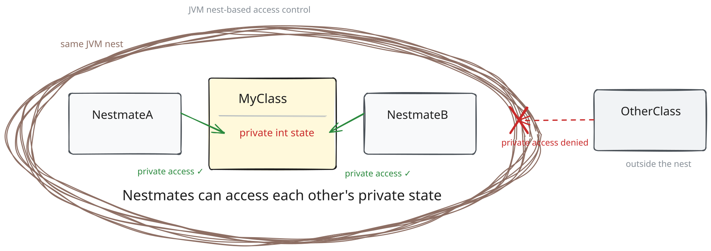
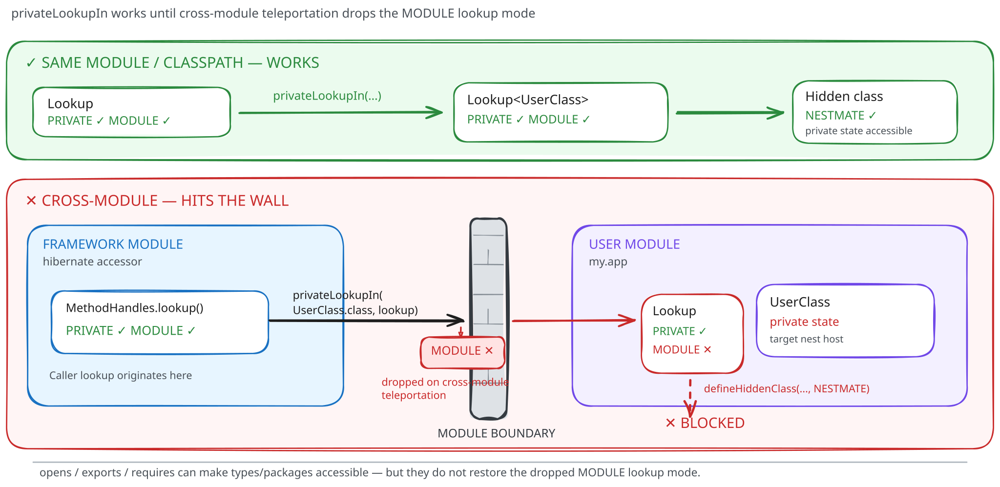
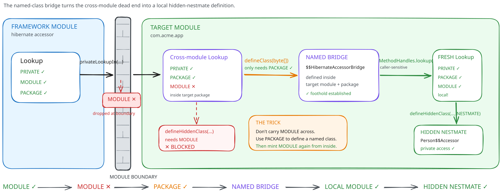
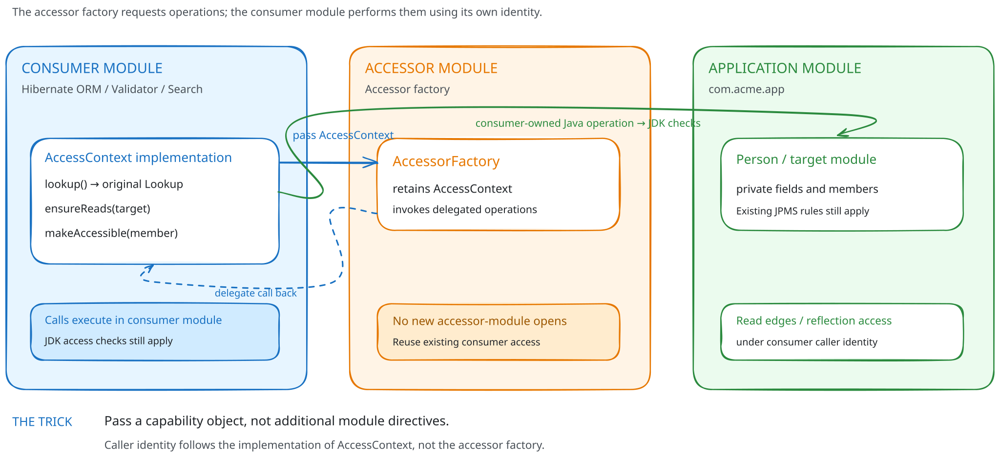
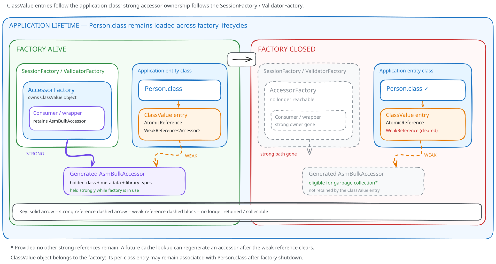

= A peek behind the curtain of modern runtime codegen (Part 2)
Marko Bekhta; Andrea Boriero
:awestruct-tags: [ "Hibernate Accessor", "Discussions" ]
:awestruct-layout: blog-post
---

When we decided to build Hibernate Accessor, our primary goal was simple -- we wanted raw, hand-written
field access speed with as little runtime overhead as possible and bytecode that the JIT can optimise as
far as it can.

As we discussed in the previous part of this series, existing JDK abstractions like `MethodHandle`
and `LambdaMetafactory` fall short for the dynamic runtime requirements of Hibernate projects. Hence,
the path forward was supposedly clear -- emit the bytecode we want, not the bytecode we are given.

Now, how would we do that ? Where should we start ? And what hidden surprises await us behind that
codegen curtain ?

== Hidden classes and nestmates might become your next best mates

The obvious step in code generation is producing the bytecode. We support three backends
for this: ASM, Byte Buddy, and link:https://openjdk.org/jeps/484[the JDK Class-File API].

Our minimum supported Java version is JDK 17, but the Class-File API became a standard
feature only in JDK 24 (it was available as a preview in earlier versions). To support
older Java versions, we use link:https://github.com/smallrye/jdk-classfile-backport[the SmallRye backport].

We support all three backends so consumers can reuse the bytecode library they already use.
The Class-File backend uses the SmallRye backport on JDK 17 and the native JDK API on JDK 24
and later, using a multi-release JAR to select the appropriate implementation. The Byte Buddy
backend uses Byte Buddy's shaded version of ASM.

With that out of the way -- how does one actually define a class generated at runtime ?
For this, we've settled on hidden classes introduced by link:https://openjdk.org/jeps/371[JEP 371].

[quote,JEP 371: Hidden Classes]
____
Hidden classes are intended for use by frameworks that generate classes at run time and use them indirectly,
via reflection. A hidden class may be defined as a member of an access control nest, and may be unloaded
independently of other classes.
____

Hidden classes are a good fit for our needs. Generated accessors should meet the following requirements:

* They exist only to serve the framework and should not be discoverable by other parts of the application.
* They should not outlive the accessor factory or the framework factory that uses them. For example, when
a `ValidatorFactory` or `SessionFactory` is closed, its generated accessors are no longer needed, and their
classes should become eligible for unloading. Actual unloading depends on the JVM.
* They need access to private members, which hidden classes support through nestmate membership.
* They should be definable through documented JDK APIs, without relying on sun.misc.Unsafe or other internal
hacks.

Hibernate's generated accessors need to access members of entity classes, including private ones. However,
in ordinary Java source code, one top-level class cannot directly access another top-level class's private members.

Java's nest-based access control provides a solution. Introduced by link:https://openjdk.org/jeps/181[JEP 181],
it allows classes belonging to the same nest to access each other's private members, even when they are compiled
into separate class files.

[quote,JEP 181: Nest-Based Access Control]
____
... nests, an access-control context that aligns with the existing notion of nested types in the Java
programming language. Nests allow classes that are logically part of the same code entity, but which
are compiled to distinct class files, to access each other's private members ...
____

Hibernate Accessor takes advantage of this feature by defining generated accessor classes as nestmates of the
entity class. Classes that belong to the same nest -- nestmates -- gain the same access capabilities as nested
classes, even if they are, in our case, "standalone" classes generated at runtime. This allows them to access
private state without changing the entities.

NOTE: The examples below are "Java-like" sketches of generated bytecode, with imports and some details omitted.

A standalone Java source class cannot directly access another top-level class's private fields;
the JVM permits these accesses because we define the generated bytecode as a nestmate.

Within the same module, a generated accessor can be defined as follows:

====
[source,java]
----
// The target entity class:
public class Person {
    private String name;

    // ...
}

// Generating and defining the hidden nestmate accessor:
public class SimpleAccessorDemo {

    public static ValueReader<String> createReader(MethodHandles.Lookup callerLookup) throws Throwable {
        // Step 1: Obtain a full-privilege Lookup anchored on Person.class
        MethodHandles.Lookup personLookup = MethodHandles.privateLookupIn( // <1>
                Person.class,
                callerLookup
        );

        // Step 2: Generate bytecode in Person's package, implementing ValueReader
        // with get(Object) returning Object and a no-argument constructor
        byte[] bytecode = generateDirectFieldReaderBytecode(Person.class, "name");

        // Step 3: Define the hidden class as a nestmate of personLookup.lookupClass()
        MethodHandles.Lookup hiddenLookup = personLookup.defineHiddenClass(
                bytecode,
                true,
                MethodHandles.Lookup.ClassOption.NESTMATE                   // <2>
        );

        Class<?> accessorClass = hiddenLookup.lookupClass();                // <3>

        // Step 4: Instantiate via MethodHandle constructor lookup
        MethodHandle constructor = hiddenLookup.findConstructor(            // <4>
                accessorClass,
                MethodType.methodType(void.class)
        ).asType(MethodType.methodType(ValueReader.class));

        return (ValueReader<String>) constructor.invokeExact();
    }
}
----
<1> `MethodHandles.privateLookupIn(class, callerLookup)` creates a new `Lookup` where `lookupClass()` is explicitly set
to `Person.class`. This is crucial: nest membership is derived from the lookup's target class,
which gives the generated accessor access to private fields.
<2> Request the `ClassOption.NESTMATE` option so that the generated class joins the nest of `Person.class`.
<3> To create an accessor instance, we first obtain its `Class` from the returned lookup
so that we can find and invoke a constructor. Since this is a hidden class with an independent lifecycle,
we need to be careful -- it can be unloaded once there are no more live references to it.
<4> Instantiate the accessor using a constructor `MethodHandle` looked up directly from the same `hiddenLookup`.
====

This works when the caller and target are in the same module and the caller supplies a full-privilege lookup.
Crossing modules changes the picture. This can also happen on the classpath with different classloaders.

== Hit a module wall ? Build a bridge !

When using JPMS, user types may reside in a different module from the library or framework. Even
if the target package is open to those libraries, and they can read the target module, this is
not sufficient to define a hidden class.

As described in link:https://bugs.openjdk.org/browse/JDK-8228624[JDK-8228624], obtaining a private
lookup across module boundaries -- teleported lookup -- makes it lose the `MODULE` access bit.
Defining hidden classes requires both `PRIVATE` and `MODULE` access bits. Hence, a teleported lookup
can no longer create a hidden class as the `MODULE` bit is lost, even though such lookup can still
access private members.

This creates a problem as a core idea for Hibernate Accessors is built around the hidden nestmate classes.

But! Not everything is lost yet (well, except that `MODULE` access bit). Luckily, the teleported
lookup still retains the `PACKAGE` access bit, which allows us to define named classes in the
target package through it! So let's use that to our advantage -- we can create a small named
synthetic bridge class across the module wall.

Why do we need this bridge? Because code running inside the bridge can obtain its own lookup,
with the `MODULE` access bit that the teleported lookup lacks. We can then use this new lookup
to define hidden nestmates, preserving the existing approach to accessing private state.

Creating this bridge class respects the module's access rules. Since we keep it package-private,
only callers that already have package access can access it. To restrict it further,
the bridge also requires a lookup to verify that the caller has legitimate access to the package.

.Generated bridge template/idea
====
[source,java]
----
package com.acme.app; // <1>

final class $$HibernateAccessorBridge {

    static Object $$defineAccessor(Lookup callerProof, Class<?> target, byte[] bytecode, Module[] reads) throws Throwable {
        // Step 1: Verify the caller can access both packages
        MethodHandles.privateLookupIn($$HibernateAccessorBridge.class, callerProof); // <2>
        MethodHandles.privateLookupIn(target, callerProof);

        // Step 2: Establish dynamic module read edges
        Module targetModule = $$HibernateAccessorBridge.class.getModule();
        for (Module dep : reads) {
            targetModule.addReads(dep); // <3>
        }

        // Step 3: Construct local full-privilege Lookup anchored on the target class
        Lookup targetLookup = MethodHandles.privateLookupIn(target, MethodHandles.lookup()); // <4>

        // Step 4: Define the hidden nestmate and return its Class
        return targetLookup.defineHiddenClass(
                bytecode,
                true,
                Lookup.ClassOption.NESTMATE
        ).lookupClass();
    }
}
----
<1> The bridge class is injected into the target package (e.g. `com.acme.app`) via `targetLookup.defineClass(bridgeBytecode)`.
Because `defineClass` only requires `PACKAGE` access, it succeeds across module boundaries when the package is opened.
<2> The bridge must never act as an open backdoor. By requiring the caller to pass its own
`Lookup` as a "proof", the bridge verifies that the caller *already* had permission to open both the bridge and the
target entity. If a foreign caller cannot perform `privateLookupIn`, access is rejected immediately.
<3> The generated hidden class in `com.acme.app` will implement framework interfaces
(such as `ValueReader` or `AsmBulkAccessor`) defined in `org.hibernate.accessor`. Since the target application's
`module-info.java` likely does not mention `org.hibernate.accessor`, the bridge dynamically adds the read edges:
`targetModule.addReads(dep)`.
<4> Because `MethodHandles.lookup()` is called *inside* `$$HibernateAccessorBridge`, it is caller-sensitive to
the target module, constructing a fresh `Lookup` with the `MODULE` access bit ! Calling `privateLookupIn(target, ...)`
transfers this full privilege to `target`, allowing `defineHiddenClass(..., NESTMATE)` to succeed.
====

The bridge caches a handle to `$$defineAccessor` in its static initializer (omitted in the example).
This allows accessors for `Person` and other classes in the same runtime package reuse it.

The bridge returns the generated `Class` while the library creates the accessor itself, outside the bridge.

This bridge has a lot of power and can create any classes inside the target module. To prevent
any arbitrary code that gets access to the bridge from creating classes we require a check first.
The check (`MethodHandles.privateLookupIn(..)`) asks for the lookup which is caller sensitive and
cannot be forged and if that caller lookup already has the required access to create classes within
the target module we let such call go through.

The bridge is shared by all classes in the same runtime package and remains loaded as long as its
defining classloader does. The generated hidden accessors, however, can be unloaded independently.

With this bridge pattern, we can continue creating the hidden nestmates even across module boundaries,
as long as those modules give us access to do so.

=== Right name, wrong classloader

There is another surprise waiting on the other side of that bridge. Suppose `Person` is loaded
by an application classloader whose parent already contains a class named `$$HibernateAccessorBridge`
in the same package. Looking up the bridge by name can find the parent's class, but that is not
our application's bridge ! A runtime package is identified by both its name and its defining
classloader, as described in link:https://docs.oracle.com/javase/specs/jvms/se24/html/jvms-5.html#jvms-5.3[JVMS §5.3].
The right name alone is not enough.

The order of operations matters too. Looking up the parent's class first can register the application
classloader as an initiating loader for that class, interfering with a later attempt to define a local
bridge with the same name. Our link:https://github.com/hibernate/hibernate-accessor/blob/main/hibernate-accessor/src/main/java/org/hibernate/accessor/spi/CrossClassLoaderLookupBridge.java[bridge implementation]
therefore attempts to define the local bridge *before* looking for an existing one.

What if two factories try to define it at the same time ? If definition throws `LinkageError`,
we look for an existing bridge and reuse it only if its classloader and module match those of `Person`.
That lets concurrent factories share the bridge without accidentally borrowing one from a parent loader
or hiding an unrelated failure.

== Borrowing access from friends

The bridge we've discussed is only useful if your module already has the required access.
That means we either need to require users to add more module-info directives for accessor modules
or relay access from modules that already have it, such as Hibernate Validator, ORM or Search.
We picked the latter. Consumers can supply their own `Lookup`, which the library wraps in `LookupAccess`, or implement
the `AccessContext` SPI in their module. A framework-owned context preserves the consumer identity
for operations such as adding read edges and enabling reflective access. Passing this context
to accessor factories allows them to perform some of the operations on behalf of the consumer module.

This context also helps with native builds. On the JVM, `LookupAccess` uses method handles resolved
with the framework's original lookup to preserve its identity when calling caller-sensitive JDK methods,
such as `Module.addReads` and `AccessibleObject.setAccessible`. Native Image has had a gap in this
mechanism: the caller was not bound to the handle, so invoking a caller-sensitive adapter could fail
because no explicit caller was available. GraalVM addressed this in
link:https://github.com/oracle/graal/pull/13927[GR-75596: Bind caller-sensitive method handles].

A framework-owned link:https://github.com/hibernate/hibernate-accessor/blob/main/hibernate-accessor/src/main/java/org/hibernate/accessor/spi/AccessContext.java[`AccessContext`]
avoids relying on that mechanism by making the calls directly from the framework module.
This preserves access authority; it does not imply that native executables support arbitrary
runtime class generation.

== What’s actually behind the curtain ?

Now that we know how to generate the accessors and what to look out for,
what does the generated bytecode actually look like ?

The following sketches follow the ASM backend; Byte Buddy reuses these generators through its shaded ASM,
while Class-File API reimplements the same shapes using its APIs. The shape changes depending on the strategy
and whether we access one or multiple values.

=== One accessor, many tricks (`TABLESWITCH`)

This is the default strategy. The main idea is to generate a single class per entity rather
than per property. To achieve this the strategy is using a switch statement which serves as
an index-based jump table -- each property is assigned an index, and at runtime we jump to a
specific case to read or write its value.

====
[source,java]
----
package com.acme.app;

public final class Person$$HibernateAccessor implements AsmBulkAccessor {

    private final BulkAccessorMetadata metadata; // <1>

    public Person$$HibernateAccessor(BulkAccessorMetadata metadata) {
        this.metadata = metadata;
    }

    @Override
    public BulkAccessorMetadata metadata() {
        return this.metadata;
    }

    @Override
    public Object readByField(Object instance, int index) {
        Person target = (Person) instance;
        switch (index) { // <2>
            case 0:
                return target.id; // <3>
            case 1:
                return target.name;
            case 2:
                return target.age;
            default:
                throw new AccessorException("Invalid field index");
        }
    }

    @Override
    public void writeByField(Object instance, int index, Object value) {
        Person target = (Person) instance;
        switch (index) {
            case 0:
                target.id = (Long) value;
                return;
            case 1:
                target.name = (String) value;
                return;
            case 2:
                target.age = toInt(value); // Integer, Byte, Short or Character; see below
                return;
            default:
                throw new AccessorException("Invalid field index");
        }
    }

    // Similar switch tables for readByMethod, writeByMethod, and newInstance...
}
----
<1> The bulk accessor instance directly owns its index metadata (`BulkAccessorMetadata`),
keeping the metadata reachable while a reader or writer retains the bulk accessor.
<2> Because member indices are assigned sequentially (`0, 1, 2...`), the bytecode emits a JVM `TABLESWITCH` opcode.
This encodes a dense jump table. Which usually should perform well, but the JVM and JIT decide how to execute it.
This shape alone does not guarantee a particular performance advantage.
<3> Because this hidden class is a nestmate of `Person`, it executes direct `GETFIELD Person.id` on `private`
fields without any synthetic bridge methods or reflection access checks.
====

The actual readers and writers (such as `ValueReader` and `ValueWriter`) returned by the factory can then be
simple, lightweight Java records holding a reference to this bulk accessor instance and the property index:

[source,java]
----
record AsmFieldValueReader<T>(AsmBulkAccessor accessor, int index) implements ValueReader<T> {
    @Override
    public T get(Object instance) {
        return (T) accessor.readByField(instance, index);
    }
}
----

=== A family affair: accessing inherited properties

In ORM entity manipulation, we frequently need to read or write a tuple of properties at once (`MultiValueReader` / `MultiValueWriter`).

If all properties belong to the same class (`Person`), we can generate a straight-line unrolled class:

[source,java]
----
public final class Person$$MultiReader implements MultiValueReader {
    @Override
    public Object[] get(Object instance) {
        Person target = (Person) instance;
        Object[] values = new Object[3];
        values[0] = target.id;
        values[1] = target.name;
        values[2] = target.age;
        return values; // Straight-line unrolled GETFIELDs!
    }
}
----

==== Family doesn’t make you a (nest-) mate

Now suppose we move `Person.id` into a shared `BaseEntity` superclass.
Our entity still has the same properties, but they no longer all belong to the same declaring class:

[source,java]
----
public class BaseEntity {
    private Long id;
}

public class Person extends BaseEntity {
    private String name;
    private int age;
}
----

Inheritance does not make two classes nestmates. In this example the two top-level classes have
separate nests, so a hidden nestmate attached to `Person` cannot access `BaseEntity.id`.
Classes in an inheritance hierarchy can only share a nest if they are also nested under the same nest host.

==== Getting the whole family involved

To address this, the factory splits the layout across declaring classes and generates a delegating accessor:

1. A bulk accessor is generated in `BaseEntity`'s nest to access `id`.
2. A bulk accessor is generated in `Person`'s nest to access `name` and `age`.
3. A coordinated `MultiBulkReader` is generated in the accessor module that holds references to both bulk accessors
and preserves the requested property order. For a tuple containing `id` and `name`, the result looks like this
(the indices are illustrative; metadata supplies the actual indices):

====
[source,java]
----
public final class HibernateAccessorMultiBulkReader implements MultiValueReader {

    private final AsmBulkAccessor accessor_0; // BaseEntity bulk accessor
    private final AsmBulkAccessor accessor_1; // Person bulk accessor

    public HibernateAccessorMultiBulkReader(AsmBulkAccessor baseAccessor, AsmBulkAccessor personAccessor) {
        this.accessor_0 = baseAccessor;
        this.accessor_1 = personAccessor;
    }

    @Override
    public Object[] get(Object instance) {
        Object[] values = new Object[2];
        // Read id through BaseEntity's nestmate accessor:
        values[0] = this.accessor_0.readByField(instance, 0);

        // Read name through Person's nestmate accessor:
        values[1] = this.accessor_1.readByField(instance, 0);
        return values;
    }
}
----
====

=== An accessor of one’s own (`PER_MEMBER`)

`BULK_SWITCH` shares one bulk accessor across the members of a declaring class.
The alternative, `PER_MEMBER`, removes the property switch from single-member access.

Instead of bundling all accessors into a jump table, this strategy generates a dedicated,
standalone hidden nestmate class for each individual field or method.

==== Reading without jumping

For `Person.name`, the generated class directly implements `ValueReader` with no switch, no index lookups, and no delegate records.
The sketch uses `ValueReader<Object>` to show the erased `get(Object): Object` signature emitted by the generator:

====
[source,java]
----
package com.acme.app;

import org.hibernate.accessor.ValueReader;

public final class Person$$HibernateAccessorReader_name implements ValueReader<Object> {

    @Override
    public Object get(Object instance) {
        // Four bytecode instructions for this reference-valued field:
        // ALOAD 1 -> CHECKCAST Person -> GETFIELD Person.name -> ARETURN
        return ((Person) instance).name; // <1>
    }
}
----
<1> The method body contains a direct `GETFIELD`. Monomorphism describes the receiver types
observed at a call site, not this instruction; a shared `ValueReader.get()` call site may still be megamorphic.
There are no intermediate records, no integer index arguments, and no `TABLESWITCH` branches.
====

==== Writing without jumping

Similarly, the writer class implements `ValueWriter` directly:

====
[source,java]
----
package com.acme.app;

import org.hibernate.accessor.ValueWriter;

public final class Person$$HibernateAccessorWriter_age implements ValueWriter {

    @Override
    public void set(Object instance, Object value) {
        Person target = (Person) instance;
        // Sketch of the generated wrapper checks and widening conversions:
        target.age = toInt(value); // <1>
    }

    private static int toInt(Object value) {
        if (value instanceof Integer v) return v.intValue();
        if (value instanceof Byte v) return v.byteValue();
        if (value instanceof Short v) return v.shortValue();
        if (value instanceof Character v) return v.charValue();
        throw new AccessorException("Cannot convert value to primitive type 'int'");
    }
}
----
<1> The generator emits these conversion checks inline, followed by `PUTFIELD`; there is no actual
`toInt` helper call. The conversion does branch, but there is no property-selection switch.
It accepts `Integer`, `Byte`, `Short` and `Character`, rejecting narrowing conversions such as `Long` to `int`
and arbitrary `Number` implementations. The bulk writer uses the same conversion logic.

That `Character` branch is easy to overlook: `char` can widen to `int`, even though `Character`
is not a `Number`. On the other hand, calling `Number.intValue()` on a `Long` would silently
narrow it. Generating a direct field write is easy. Preserving the expected conversions takes
more work.
====

=== The getter throws; who catches it ?

Fields are only half the story. Let's assume `Person.getName()` throws an exception. Swapping accessor
strategies should not change what the caller catches: our API promises to propagate the exact
throwable raised by a getter or setter, whether it is a runtime exception, an error or a checked exception.

Generated accessors get this naturally from a direct method invocation. Reflection, however, wraps
the getter's exception in `InvocationTargetException`. The reflection backend unwraps it and uses
an internal link:https://github.com/hibernate/hibernate-accessor/blob/main/hibernate-accessor/src/main/java/org/hibernate/accessor/internal/AccessorThrowables.java[`sneakyThrow` helper]
to rethrow the original instance. The method-handle and lambda backends use the same helper where needed.
Checked-exception declarations are enforced by the Java compiler, not by the JVM at invocation time,
so the generated accessor can propagate a checked exception even though `ValueReader.get()` declares none.

This distinction matters -- an exception from `Person.getName()` remains the application's exception;
an accessor infrastructure failure is a separate problem. A shared API needs consistent behaviour.

=== Sharing the stage or going solo ?

Neither of these two strategies is perfect. While `BULK_SWITCH` can be a safe default,
`PER_MEMBER` has its place too.

[stripes="even", options="header"]
|===
| Strategy | Generated Classes for Single-Member Access | Indirection / Dispatch | Relative Generated-Class Footprint | Trade-off

| **`BULK_SWITCH`**
| **1 bulk class per declaring class, per factory while cached**
| Hop through `AsmFieldValueReader` record $\rightarrow$ `TABLESWITCH` jump table $\rightarrow$ `GETFIELD`
| **Fewer classes**, but switch bytecode grows with member count
| Shares dispatch infrastructure across properties; performance depends on the workload.

| **`PER_MEMBER`**
| **1 class per field/getter/setter**
| Direct field access or method invocation in the reader/writer; no bulk delegate
| **Higher** (scales linearly with the number of accessed members)
| Smaller method bodies, but more generated receiver types at shared call sites.
|===

Multi-value readers and writers use the direct or coordinated shapes described above with either strategy.

== The factory closes -- the accessors hit the road

Generating classes has a cost. The readers for `Person.name` and `Person.age` should reuse
the same `Person` bulk accessor, while inherited `id` access uses the cached `BaseEntity` accessor.
Since each bulk accessor belongs to a declaring class, `ClassValue` feels like a natural cache option.

link:https://docs.oracle.com/en/java/javase/17/docs/api/java.base/java/lang/ClassValue.html[`ClassValue`]
associates lazily computed values with classes. It supports concurrent access, although competing
threads may compute more than one candidate value before one is installed. Our cache adds a
synchronised slot to coordinate accessor generation.

While `ClassValue` seems perfect on paper, using it carelessly can retain generated accessor
classes for longer than required.

Generated accessors are tied to the lifecycle of the framework factory that uses them, such as
Hibernate ORM's `SessionFactory` or Hibernate Validator's `ValidatorFactory`. When that factory
is destroyed, its accessor factory and generated accessors are no longer needed and should become
eligible for garbage collection.

Imagine closing a `SessionFactory` while continue running the application and using the model classes.
`Person.class` and `BaseEntity.class` may remain loaded throughout, even though the old factory
and its accessors are no longer needed. Stale `ClassValue` entries can remain in these classes'
internal maps until cleanup, even after the `ClassValue` instance itself is no longer reachable.

If one of these entries strongly references a generated accessor, it can unintentionally keep the accessor
and its associated library classes and classloader alive long after the owning factory has been destroyed.

In other words, `Person.class` may outlive the factory, but its cached accessor shouldn't have to.

To avoid this lifetime mismatch, we store generated accessors in `ClassValue` through `WeakReference`
rather than strong ones:

[source,java]
----
ClassValue<AtomicReference<WeakReference<AsmBulkAccessor>>> cache;
----

While the framework factory is alive, its infrastructure holds strong references to the accessors it uses.
This ensures that generated accessors remain available throughout the factory's lifetime, while the `ClassValue`
cache provides an efficient way to find and reuse them.

Once the framework releases those strong references, `Person.class` and its `ClassValue` entries
may still exist, but their weak references no longer prevent the generated accessors from being garbage-collected.
This removes the cache's strong retention path to the associated library classloader;
other live references can still keep that loader alive.

A weak reference can be cleared once the framework no longer holds any accessors backed by that bulk accessor.
If an accessor is requested again, the cache can regenerate it; a new factory can also generate its own accessor
when it needs `Person.name`.

.The entity outlives the factory -- the cached accessor should not

== Looks fast. Is it though ?

We now have accessors that can reach private state, cross module boundaries and leave with their factory.
But the goal we started with was speed. How much does the shape of the generated code tell us about
performance once a framework puts it to work ?

In the next part, we'll turn to measurements and see how well the promise of a small accessor holds up
in a larger workload. There may be a few more surprises waiting behind that curtain yet.

== Feedback and discussions

We welcome your thoughts and feedback. Join the discussion:

* https://hibernate.zulipchat.com/#narrow/stream/132096-hibernate-user[Zulip chat] (usage questions, development-related discussions, general feedback)
* https://github.com/hibernate/hibernate-accessor[Issue tracker] (bug reports, feature requests)
* http://lists.jboss.org/pipermail/hibernate-dev/[Mailing list] (development-related discussions)
